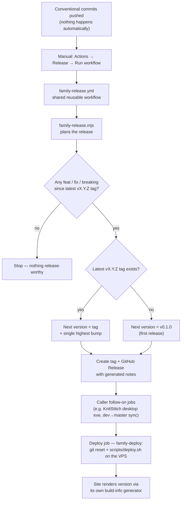

# Git Rules

This is the canonical git rules document for the Structured Chaos family of projects. All child repos read from this file. Per-repo scope lists and versioning-mechanic details live in each repo's own `AGENTS.md`.

- All projects use [Conventional Commits](https://www.conventionalcommits.org/) to drive automatic versioning and changelog generation.
- Commit everything that is dirty unless specified otherwise.
- Use more than one commit if needed across multiple files.
- List commit messages for review before running git command:

```
git commit
```

- Do not commit before being asked to do so.

## Commit Message Format

```
<type>(<scope>): <description>

<optional body>
```

- The **type** is mandatory and determines the version bump.
- The **scope** is optional but encouraged for clarity (e.g. `css`, `deploy`, `sketch`).
  - Avoid scopes that are too broad (e.g. just `cms` for the Craft site).
- The **description** should be lowercase, imperative, and concise.
- The **body** is optional but encouraged unless it causes duplication of the description.
  - Bullet points are preferred.

### Footers

Avoid adding non-functional footers such as `Generated with [Devin](https://devin.ai)` or `Co-Authored-By: Devin ...` to commit messages. These are not part of the project's conventional commit format and add noise to the changelog.

Functional footers are allowed only when they carry meaning for the project:

- `BREAKING CHANGE:` to signal a breaking change
- `Signed-off-by:` if the project requires DCO sign-off

## Commit Types and Version Impact

| Type                                  | Version bump | Changelog group                  |
|---------------------------------------|-------------|----------------------------------|
| `feat`                                | **minor** (e.g. 1.3.0 → 1.4.0) | Features                         |
| `fix`                                 | **patch** (e.g. 1.3.0 → 1.3.1) | Fixes                            |
| `docs`                                | none | Documentation                    |
| `refactor`                            | none | Refactors                        |
| `test`                                | none | Tests                            |
| `chore`                               | none | Maintenance                      |
| `style` / `ui`                        | none | Styling / UI (no logic change)   |
| any + `BREAKING CHANGE` footer or `!` | **major** (e.g. 1.3.0 → 2.0.0) | Breaking changes                 |

> Note: individual repos may use `style` (KnitStitch) or `ui` (BoxOfDragons) for the no-logic-change styling type. Use whichever the repo's history already follows.

Commits that don't match a release-worthy type (anything not `feat`, `fix`, or breaking) do not bump the version and do not trigger a release. Versions are always three numbers (`vX.Y.Z`) — there is no revision component.

## Breaking Changes

To signal a breaking change, either:

- Add `BREAKING CHANGE:` in the commit body footer, or
- Add `!` after the type/scope: `feat(api)!: redesign endpoint structure`

## Examples

```
feat(tag): add post tags filter to archive sidebar
fix(css): correct card image aspect ratio on mobile
docs(readme): update deployment instructions
refactor(ui): split bootstrap and UI wiring
test(fields): add post field layout coverage
chore(build): regenerate build info for v1.17.0
style: update app styles and index.html
feat(api)!: remove deprecated v1 endpoints

BREAKING CHANGE: v1 endpoints are no longer available.
```

## Release Workflow

Releases are **always manual** — never cut automatically on push. To release a project, run its **Release** workflow: GitHub → Actions → Release → Run workflow (or `gh workflow run release.yml`).

The Release workflow is also **the only deploy path**: it versions, tags, releases, and deploys in one run. Pushes never deploy — the GitHub→VPS webhooks were removed. (Exception: QR has no VPS repo checkout and still deploys by manual `scp`.)

### How a release flows



### Shared machinery (this repo)

- `scripts/family-release.mjs` — canonical versioning engine. Reads git tags and the conventional commit log, finds the single highest pending bump, and writes a release plan (`.github/release-plan.json`) plus release notes (`.github/release-notes.md`). Optionally consumes a repo-root `release-notes.ai.json` for AI-reworded entry titles/details.
- `.github/workflows/family-release.yml` — reusable workflow (`workflow_call`). Checks out the caller repo, sparse-checks out `family-release.mjs` from this repo, plans, creates the `vX.Y.Z` tag, and creates the GitHub Release. All release policy lives here: bot guard, should-release gating, tag format, notes format.
- `.github/workflows/family-deploy.yml` — reusable SSH deploy (`workflow_call`). Runs `git fetch` + `git fetch --tags` + `git reset --hard` on the VPS, then executes the repo's own `scripts/deploy.sh` if present. Invoked as a `deploy` job inside each caller's `release.yml` (or standalone for deploy-only runs). Expects `PROD_HOST`, `PROD_USER`, `PROD_SSH_KEY`, `PROD_PORT`, `PROD_PATH` secrets (prefer org-level so every repo inherits them).

### Caller convention

Every family repo has `.github/workflows/release.yml`:

```yaml
name: Release

on:
  workflow_dispatch:

jobs:
  release:
    uses: Box-of-Dragons/StructuredChaos/.github/workflows/family-release.yml@master
    secrets: inherit

  deploy:
    needs: release
    if: always() && !failure() && !cancelled()
    uses: Box-of-Dragons/StructuredChaos/.github/workflows/family-deploy.yml@master
    with:
      branch: master   # main for JSketcher
    secrets: inherit
```

The `deploy` job runs on every manual run — even when no release was cut (e.g. docs-only changes still ship). Repos whose VPS path needs post-reset build steps keep them in `scripts/deploy.sh` at the repo root.

Rules for callers:

- Trigger is **`workflow_dispatch` only** — do not add `push` triggers to release workflows. Push-triggered automation (lint, test, deploy) belongs in other workflow files.
- Keep `secrets: inherit` so org secrets flow through.
- Pin `@master` so shared changes propagate immediately; pin a tag (e.g. `@v1`) only if controlled rollout of pipeline changes is ever needed.
- Repos that need a prepare step (dependency install, AI release notes) pass `node-version` and `prepare-command` inputs; the shared workflow exposes `OPENAI_API_KEY`, `OPENAI_RELEASE_NOTES_MODEL`, `OPENROUTER_API_KEY`, `OPENROUTER_MODEL` to that step.

Available `workflow_call` inputs: `create-tag`, `create-release` (both default `true`), `node-version`, `prepare-command`, `family-ref` (which ref of this repo to pull the engine from).

Job outputs available to follow-on jobs in the caller: `release_tag`, `should_release`, `display_version` — e.g. KnitStitch's `desktop-release` job builds the portable exe and attaches it to `release_tag`.

### Changing release behavior

Edit `family-release.mjs` (versioning logic, notes format) or `family-release.yml` (when/how releases run) in this repo — every caller picks it up on the next run. Never reimplement release logic in a caller repo.

### Versioning across the family

| Repo | Release branch | Version display | Deploy | Notes |
|---|---|---|---|---|
| StructuredChaos | `master` | none (static site) | Release → deploy job (git reset only) | Hosts the shared engine + reusable workflows |
| BoxOfDragons | `master` | `scripts/GenerateBuildInfo.php` → `web/js/buildInfo.js` + `web/changelog.html` | Release → deploy job → `scripts/deploy.sh` | Changelog entries labelled with the release segment they landed in; `deploy.yml` remains as a manual deploy-only fallback |
| KnitStitch | `dev` → `master` | `scripts/generate-build-info.mjs` (reads GitHub Releases) → `public/js/buildInfo.js` + `CHANGELOG.md` | Release → deploy job → `scripts/deploy.sh` | AI release notes via `prepare-command`; `desktop-release` job attaches the portable exe; `sync-master` fast-forwards `master` before deploy |
| JSketcher | `main` | `scripts/generate-changelog.mjs` → `docs/changelog.md` + `web/changelog-fragment.html` | Release → deploy job → `scripts/deploy.sh` | Fork commits only — upstream (xibyte) history excluded via `git cherry` |
| QR | `master` | none | manual `scp` (VPS docroot is not a git repo) | Release workflow creates tag + GitHub Release only |
| BetterAuth | `master` | none | Release → deploy job → `scripts/deploy.sh` (`npm ci`, `auth migrate`, `npm run build`, `pm2 reload`) | deploy.sh sources `.env` for `DATABASE_URL` |
| SolverWasm | `master` | — | — | Not wired: legacy tags aren't `vX.Y.Z`; seed a baseline tag (e.g. `v3.2.0`) before adding a release caller |

All version display generators (whatever the stack) follow the same algorithm:

1. Reads all git tags matching `vX.Y.Z` and uses the latest tag as the starting version.
2. Walks the commit log (oldest first) from the last tagged commit.
3. Finds the single highest bump among those commits per the rules above and applies it once — that is the next release version.
4. Outputs the resolved version and changelog in the repo's chosen format.

If no tags exist, the first release is always `v0.1.0`.

## Tagging

Release tags (`vX.Y.Z`) are created automatically by the Release workflow — do not tag releases by hand. The one legitimate manual use is seeding a **baseline tag** on a repo adopting this scheme, so the next release increments from a known point rather than `v0.1.0`:

```
git tag v1.4.0
git push origin v1.4.0
```

A tag pins the version at that point. All commits after the tag increment from the tagged version.

## Scopes

Scopes are **project-specific** — see each repo's `AGENTS.md` for the common scopes used in that project. Scopes are not enforced; use whatever best describes the area of change.
