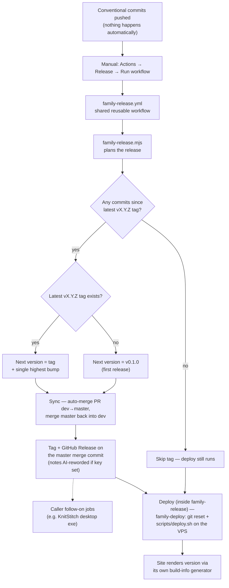

# Git Rules

This is the canonical git rules document for the Structured Chaos family of projects. All child repos read from this file. Per-repo scope lists and versioning-mechanic details live in each repo's own `AGENTS.md`.

- All projects use [Conventional Commits](https://www.conventionalcommits.org/) to drive automatic versioning and changelog generation.
- Commit everything that is dirty unless specified otherwise.
- Use more than one commit if needed across multiple files.
- List commit messages for review before running git command:

```
git commit
```

- Do not commit before being asked to do so.

## Commit Message Format

```
<type>(<scope>): <description>

<optional body>
```

- The **type** is mandatory and determines the version bump.
- The **scope** is optional but encouraged for clarity (e.g. `css`, `deploy`, `sketch`).
  - Avoid scopes that are too broad (e.g. just `cms` for the Craft site).
- The **description** should be lowercase, imperative, and concise.
- The **body** is optional but encouraged unless it causes duplication of the description.
  - Bullet points are preferred.

### Footers

Avoid adding non-functional footers such as `Generated with [Devin](https://devin.ai)` or `Co-Authored-By: Devin ...` to commit messages. These are not part of the project's conventional commit format and add noise to the changelog.

Functional footers are allowed only when they carry meaning for the project:

- `BREAKING CHANGE:` to signal a breaking change
- `Signed-off-by:` if the project requires DCO sign-off

## Commit Types and Version Impact

| Type                                  | Version bump | Changelog group                  |
|---------------------------------------|-------------|----------------------------------|
| `feat`                                | **minor** (e.g. 1.3.0 → 1.4.0) | Features                         |
| `fix`                                 | **patch** (e.g. 1.3.0 → 1.3.1) | Fixes                            |
| `docs`                                | **patch** | Documentation                    |
| `refactor`                            | **patch** | Refactors                        |
| `test`                                | **patch** | Tests                            |
| `chore`                               | **patch** | Maintenance                      |
| `style` / `ui`                        | **patch** | Styling / UI (no logic change)   |
| anything else / non-conventional      | **patch** | Other changes                    |
| any + `BREAKING CHANGE` footer or `!` | **major** (e.g. 1.3.0 → 2.0.0) | Breaking changes                 |

> Note: individual repos may use `style` (KnitStitch) or `ui` (BoxOfDragons) for the no-logic-change styling type. Use whichever the repo's history already follows.

The rule is simple: `feat` → minor, breaking → major, **everything else → patch**. Any commit since the latest tag warrants a release — only a run with zero new commits cuts no version. Versions are always three numbers (`vX.Y.Z`) — there is no revision component.

## Breaking Changes

To signal a breaking change, either:

- Add `BREAKING CHANGE:` in the commit body footer, or
- Add `!` after the type/scope: `feat(api)!: redesign endpoint structure`

## Examples

```
feat(tag): add post tags filter to archive sidebar
fix(css): correct card image aspect ratio on mobile
docs(readme): update deployment instructions
refactor(ui): split bootstrap and UI wiring
test(fields): add post field layout coverage
chore(build): regenerate build info for v1.17.0
style: update app styles and index.html
feat(api)!: remove deprecated v1 endpoints

BREAKING CHANGE: v1 endpoints are no longer available.
```

## Release Workflow

Releases are **always manual** — never cut automatically on push. To release a project, run its **Release** workflow: GitHub → Actions → Release → Run workflow (or `gh workflow run release.yml`).

The Release workflow is also **the only deploy path**: it versions, tags, releases, and deploys in one run. Pushes never deploy — the GitHub→VPS webhooks were removed. (Exception: QR has no VPS repo checkout and still deploys by manual `scp`.)

### Branch model

- `dev` is the **default, unprotected working branch** — all commits land here; push freely.
- `master` (`main` for JSketcher) is the **protected release branch**: a repository ruleset blocks direct pushes, force-pushes, and deletion — changes arrive only via pull request.
- The Release workflow opens and merges that PR automatically when dispatched on `dev` (the `release-branch` input), then **tags the merge commit** — so `master`'s tip is always the released point. The result is merged back into `dev` so tags stay reachable there.
- Dispatching on `master`/`main` directly is still allowed for hotfixes (sync is skipped, tag lands on the branch tip).
- BetterAuth is private on the free org — GitHub blocks rulesets there, so its `master` is unprotected (discipline only).

### How a release flows



### Shared machinery (this repo)

- `scripts/family-release.mjs` — canonical versioning engine. Reads git tags and the conventional commit log, finds the single highest pending bump, and writes a release plan (`.github/release-plan.json`) plus release notes (`.github/release-notes.md`). With `--ai-notes` it rewords titles/details via OpenAI/OpenRouter into a repo-root `release-notes.ai.json` cache (keyed by commit sha) — no per-repo script needed, and repos without an API key fall back to heuristic titles.
- `.github/workflows/family-release.yml` — reusable workflow (`workflow_call`). Checks out the caller repo, sparse-checks out `family-release.mjs` from this repo, plans, syncs the release branch, creates the `vX.Y.Z` tag, creates the GitHub Release — then deploys via `family-deploy.yml` on success. All release policy lives here: bot guard, should-release gating, tag format, notes format, deploy ordering.
- `.github/workflows/family-deploy.yml` — reusable SSH deploy (`workflow_call`). Runs `git fetch` + `git fetch --tags` + `git reset --hard` on the VPS, then executes the repo's own `scripts/deploy.sh` if present. Normally invoked as the `deploy` job inside `family-release.yml`; can also be called standalone for deploy-only runs. Expects `PROD_HOST`, `PROD_USER`, `PROD_SSH_KEY`, `PROD_PORT`, `PROD_PATH` secrets (prefer org-level so every repo inherits them).
- `.github/workflows/family-pr.yml` — reusable PR opener (`workflow_call`). Opens or updates a `source-branch → base-branch` PR with a derived conventional title and the commit titles as the body; the `merge` input squash-merges in the same run with that title/body as the commit message. Callers are thin `workflow_dispatch`-only `pr.yml` files.

### Caller convention

Every family repo has `.github/workflows/release.yml`:

```yaml
name: Release

on:
  workflow_dispatch:

jobs:
  release:
    uses: Box-of-Dragons/StructuredChaos/.github/workflows/family-release.yml@master
    permissions:
      contents: write        # tag pushes, branch back-merges
      pull-requests: write   # the dev → release-branch sync PR
    with:
      release-branch: master   # main for JSketcher
    secrets: inherit
```

The `permissions` grant is **required**: repos default `GITHUB_TOKEN` to read-only, and a reusable workflow can only reduce permissions through the call chain — never elevate. Without it the run dies at startup with "requesting 'contents: write, pull-requests: write', but is only allowed 'contents: read, pull-requests: none'".

That's the whole caller — the shared workflow syncs, tags, releases, **and deploys**. Deploy runs on every manual run, even when no release was cut (i.e. no commits since the last tag). Repos whose VPS path needs post-reset build steps keep them in `scripts/deploy.sh` at the repo root. Repos that must not SSH-deploy pass `deploy: false`.

Rules for callers:

- Trigger is **`workflow_dispatch` only** — do not add `push` triggers to release workflows. Push-triggered automation (lint, test, deploy) belongs in other workflow files.
- Keep `secrets: inherit` so org secrets flow through.
- Pin `@master` so shared changes propagate immediately; pin a tag (e.g. `@v1`) only if controlled rollout of pipeline changes is ever needed.
- `release-branch` names the protected release branch (`master`, or `main` for JSketcher). When a run is dispatched on a different branch (normally `dev`), the shared workflow merges it into the release branch via an auto-created PR, merges the result back into the dispatch branch, then tags the merge commit — so tags live on the release branch tip.
- AI release notes are on by default (`ai-notes`). When `OPENAI_API_KEY` or `OPENROUTER_API_KEY` is set on the repo (org secrets work too), titles/details are reworded into user-facing language and the `release-notes.ai.json` cache is saved to a dedicated `release-notes-cache` orphan branch — keeping `chore(release-notes)` commits out of the working-branch history. Repos without a key silently keep heuristic titles. `project-description` tunes the prompt.
- Repos that need a prepare step (e.g. dependency install) pass `node-version` and `prepare-command` inputs.

Available `workflow_call` inputs: `create-tag`, `create-release`, `ai-notes`, `deploy` (all default `true`), `project-description`, `release-branch`, `prod-path`, `deploy-script`, `environment`, `node-version`, `prepare-command`, `family-ref` (which ref of this repo to pull the engine from).

Job outputs available to follow-on jobs in the caller: `release_tag`, `should_release`, `display_version` — e.g. KnitStitch's `desktop-release` job builds the portable exe and attaches it to `release_tag`.

### Pull requests into dev

Feature branches land on `dev` via squash-merged PRs so `dev`'s log stays one conventional commit per unit of work. The manual **PR to dev** workflow (a thin caller of `family-pr.yml`) does the mechanics — no AI involved, everything is derived from the commit log:

- **Title** — the commit subject itself when the branch is one commit ahead; otherwise the most significant conventional subject (`feat` > `fix` > first conventional; falls back to `chore: merge <branch> into dev`), flagged with `!` when any commit in the range is breaking.
- **Body** — the bullet list of commit subjects, oldest first.
- **`merge` input** — when ticked, the workflow squash-merges immediately via `gh pr merge --squash --subject --body`, so the landed commit is `<title> (#<pr>)` + commit titles — the `(#n)` suffix makes PR-sourced commits obvious in the log. Unticked, the PR waits for a manual squash merge in the UI — GitHub prefills the same shape.

Caller shape is the same as `release.yml`: `workflow_dispatch` with a `merge` input, `permissions: contents: write, pull-requests: write`, `secrets: inherit`, pinned `@master` — and `source-branch: ${{ github.ref_name }}`, so the source is whichever branch the run is dispatched from ("Use workflow from" in the UI).

### Changing release behavior

Edit `family-release.mjs` (versioning logic, notes format) or `family-release.yml` (when/how releases run) in this repo — every caller picks it up on the next run. Never reimplement release logic in a caller repo.

### Versioning across the family

| Repo | Working → release branch | Version display | Deploy | Notes |
|---|---|---|---|---|
| StructuredChaos | `dev` → `master` | none (static site) | Release → deploy job (git reset only) | Hosts the shared engine + reusable workflows |
| BoxOfDragons | `dev` → `master` | `scripts/GenerateBuildInfo.php` → `web/js/buildInfo.js` + `web/changelog.html` | Release → deploy job → `scripts/deploy.sh` | Changelog entries labelled with the release segment they landed in; `deploy.yml` remains as a manual deploy-only fallback |
| KnitStitch | `dev` → `master` | `scripts/generate-build-info.mjs` (reads GitHub Releases) → `public/js/buildInfo.js` + `CHANGELOG.md` | Release → deploy job → `scripts/deploy.sh` | `desktop-release` job attaches the portable exe |
| JSketcher | `dev` → `main` | `scripts/generate-changelog.mjs` → `docs/changelog.md` + `web/changelog-fragment.html` | Release → deploy job → `scripts/deploy.sh` | Fork commits only — upstream (xibyte) history excluded via `git cherry` |
| QR | `dev` → `master` | none | Release → deploy job (git reset only — docroot is a `master` checkout) | No build step |
| BetterAuth | `dev` → `master` | none | Release → deploy job → `scripts/deploy.sh` (`npm ci`, `auth migrate`, `npm run build`, `pm2 reload`) | `master` unprotected (private repo, free org); deploy.sh sources `.env` for `DATABASE_URL` |
| SolverWasm | `dev` → `master` | — | — | Not wired: legacy tags aren't `vX.Y.Z`; seed a baseline tag (e.g. `v3.2.0`) before adding a release caller |

All version display generators (whatever the stack) follow the same algorithm:

1. Reads all git tags matching `vX.Y.Z` and uses the latest tag as the starting version.
2. Walks the commit log (oldest first) from the last tagged commit.
3. Finds the single highest bump among those commits per the rules above (`feat` → minor, breaking → major, everything else → patch) and applies it once — that is the next release version.
4. Outputs the resolved version and changelog in the repo's chosen format.

If no tags exist, the first release is always `v0.1.0`.

## Tagging

Release tags (`vX.Y.Z`) are created automatically by the Release workflow — do not tag releases by hand. The one legitimate manual use is seeding a **baseline tag** on a repo adopting this scheme, so the next release increments from a known point rather than `v0.1.0`:

```
git tag v1.4.0
git push origin v1.4.0
```

A tag pins the version at that point. All commits after the tag increment from the tagged version.

## Scopes

Scopes are **project-specific** — see each repo's `AGENTS.md` for the common scopes used in that project. Scopes are not enforced; use whatever best describes the area of change.
